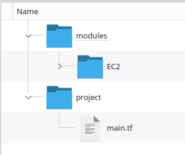

# 7. Terraform Modules

---

## Terraform Modules Recap

In an earlier section, it was said that a Terraform application was made up of modules
- There was always a _root_ module from with Terraform was run
- So far in this class, all the work done has been in the root module

Modules are analogous to subroutines
- The root module is like the mainline
- The root module can call other modules
- And other modules can also call other modules
- Just like subroutines in code

---

# Multiple Environments

Cloud advantage: create multiple copies of the same environment
- Production, Development, Test
- Environments need to be similar if not identical
- Different environments will have parts that are exactly the same


We want to be able to re-use Terraform code across environments
- DRY Principle: "Do not repeat yourself"
- We want to write re-usable code in only one place.
- Modules allow us to reuse Terraform code

---

## Module Basics

Any folder containing terraform files is a module
- There is no special declaration or syntax required for it to be identified as a module.
- Conceptually, modules are containers for multiple resources that are used together
- Modules are the primary mechanism used to package and reuse terraform resources

Every terraform configuration has at least one module
- It is referred to as the "root" module
- It consists of the terraform files in the main working directory

Any module, not just the root, may import other or "call" other modules
- Modules that are being called are called _child_ modules

---

## Example

If we are creating the same resource in multiple configurations, we can create a reusable module for it

In this example, the configuration uses a module in the _modules/EC2_ folder to create an EC2 instance

The code for this example is in the directory `example-1/ex6-1`
The folder structure looks like this:



Note that we are not making the module a subdirectory of the project module. This creates a spurious coupling between the project and the EC2 module.

A better practice is to thing of the modules as residing in a module library. 
- Later in code management, we will see that this allows for more effective managements of large projects and multiple modules.

---

The EC2 module looks like this. This just what we have seen before. But note that there is no providers specified

```terraform
resource "aws_instance" "alpha" {
    ami = "ami-080e1f13689e07408"
    instance_type = "t2.nano"
    tags = {
        source = "EC2 Module"
    }
}
```

The root module in the `Project` folder has a `providers.tf` file. This is where our Terraform commands are run from which is one reason why we designate the `Project` folder as the root folder.

The actual code in the `main.tf` root module is just a reference or call to the EC2 module.

The `module` directive creates a reference to the EC2 module called `"EC2Defs"` and contains the path or where the module should be sourced from

```terraform
module "EC2Defs" {
    source = "../modules/EC2"
}
```

If we run `terraform init` from the root module, the command also initializes the specified modules.


```console
$ terraform init

Initializing the backend...
Initializing modules...
- EC2Defs in ../modules/EC2

Initializing provider plugins...
- Finding hashicorp/aws versions matching "~> 3.0"...
- Installing hashicorp/aws v3.76.1...
- Installed hashicorp/aws v3.76.1 (signed by HashiCorp)

Terraform has created a lock file .terraform.lock.hcl to record the provider
selections it made above. Include this file in your version control repository
so that Terraform can guarantee to make the same selections by default when
you run "terraform init" in the future.

Terraform has been successfully initialized!
```

We can then confirm at the console that the EC2 instance was deployed

---

## Creating Multiple Resources

We can create multiple copies of a resource by making repeated calls to the module like so:

```terraform
module "vm1" {
    source = "../modules/EC2"
}

module "vm2" {
    source = "../modules/EC2"
}
```
This will produce two EC2 instances running but they will have identical configurations

---

## Parametrized Modules

Recall from an earlier that we can think of a module as being like a function call.

This is where we can use Terraform variables to parameterize the Module

Create the parameter variables in a `variables.tf` file

```terraform
variable "ami_type" {
    type = string
    default = "ami-080e1f13689e07408"
}

variable "inst_type" {
    type = string
    default = "t2.nano"
}

variable VM_name {
    type = string
    default = "EC2-Module"
}
```

It is considered to be a good practice during development to provide reasonable default values for the parameters so that deployments do not break from a calling module not providing a value. 

However, it may not be desirable to have defaults in a production environment where the presence of defaults masks the fact that certain parameters might not have been provided correctly. 
- This might result in a misconfigured deployment that spins up but then behaves anomalously.  
- Near-prod test runs should validate that the deployment spins up correctly without default parameters, unless the defaults are part of the specification.

Now parameterize the EC2 code

```terraform 
resource "aws_instance" "alpha" {
    ami = var.ami_type
    instance_type = var.inst_type
    tags = {
        source = "EC2 Module"
        Name = var.VM_name
    }
}
```

Now we can call create three VMs with different parameters.

```Terraform

module "vm1" {
    source = "../modules/EC2"
    ami_type = "ami-0d7a109bf30624c99"
    inst_type - "t2.medium"
    VM_name = "VM-1"
}

module "vm2" {
    source = "../modules/EC2"
    inst_type - "t2.micro"
    VM_name = "VM-2"
}

module "VM-1" {
    source = "../modules/EC2"
    VM_name = "VM-3"
  }
```

## Parameterizing Module Calls

There is still a lot of hardcoded values in the root module, so we can replace those with variables as well.

First we can create a `variables.tf` file in the root module which provides lists of values to be used in the creation of the three VMs

```terraform
variable "amis" {
    type = list(string)
}

variable "insts" {
    type = list(string)
   
}

variable names {
    type = list(string)
}
```

The corresponding `terraform.tfvars` file looks like this:

```terraform
amis = ["ami-080e1f13689e07408","ami-080e1f13689e07408","ami-0d7a109bf30624c99"]
insts = ["t2.nano", "t2.nano", "t2.micro"]
names = ["Frodo", "Gandalf", "Gollum"]
```

Then we can parameterize the root module like this:

```terraform


module "vm1" {
    source = "../modules/EC2"
    ami_type = var.amis[0]
    inst_type = var.insts[0]
    VM_name = var.names[0]

}

module "vm2" {
    source = "../modules/EC2"
    ami_type = var.amis[1]
    inst_type = var.insts[1]
    VM_name = var.names[1]

}

module "vm3" {
    source = "../modules/EC2"
     ami_type = var.amis[2]
    inst_type = var.insts[2]
    VM_name = var.names[2]
  }
```

## Using Count

There is still a lot of repeated code. In a previous module we saw how we could use `count` to create multiple copies of a resource.

Modifying the `main.tf` file with `count` cleans up the code.

```terraform
module "vm" {
    count = length(var.names)
    source = "../modules/EC2"
    ami_type = var.amis[count.index]
    inst_type = var.insts[count.index]
    VM_name = var.names[count.index]
}
```

---

## Lab 7-1

---